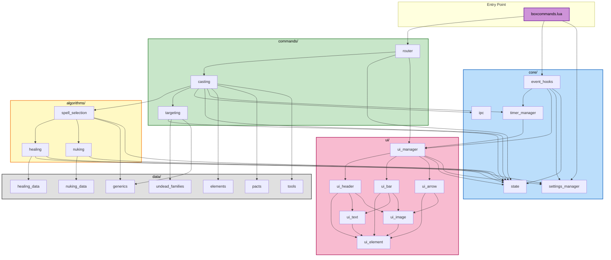

# Component Dependencies

## Dependency Diagram



## Dependency Rules

### No Circular Dependencies
- `core/` depends on nothing else (except `data/` for generics)
- `data/` depends on nothing (pure static tables)
- `commands/` depends on `core/`, `algorithms/`, `data/`
- `algorithms/` depends on `core/`, `data/`
- `ui/` depends on `core/` (for state and settings)
- Entry point depends on `core/` and `commands/`

### Communication Patterns

| From | To | Pattern |
|------|-----|---------|
| boxcommands.lua → router | Direct function call | Synchronous |
| router → casting | Direct function call | Synchronous |
| casting → ipc | Direct function call | Fire-and-forget (send command) |
| casting → spell_selection | Direct function call, returns result | Synchronous |
| event_hooks → timer_manager | Direct function call | Per-frame tick |
| event_hooks → ui_manager | Direct function call | Per-frame update |
| event_hooks → settings_manager | Direct function call | On job_change event |
| timer_manager → ui_manager | Callback/notify | Timer expire triggers UI reposition |
| Any module → settings_manager | Direct function call | Read/write settings |
| Any module → state | Direct function call | Read/write global state |

### Data Flow Summary

```text
User Input
  → router (parse command)
    → casting (select spell, resolve target)
      → spell_selection (choose tier)
        → healing/nuking algorithms (calculate optimal)
          → data tables (lookup formulas)
          → state (read cached stats)
      → targeting (resolve final target)
        → data/undead_families (check enemy type)
      → ipc (relay or execute locally)
    → timer_manager (schedule recast timer)
      → ipc (broadcast timerui to all boxes)
  → ui_manager (create visual timer bar)

Game Events (per frame)
  → event_hooks.on_prerender()
    → timer_manager.tick() (decrement timers)
    → ui_manager.update() (animate arrows, update bars, check menu)

Job Change Event
  → event_hooks.on_job_change()
    → settings_manager.update_job()
    → (delay) settings_manager.update_max_hp()
```

## External Dependencies

| External | Used By | Purpose |
|----------|---------|---------|
| Windower `resources` | spell_selection, casting, data modules | Game data lookups |
| Windower `texts` | ui_text | Text primitive creation |
| Windower `images` | ui_image, ui_bar, ui_header, ui_arrow | Image primitive creation |
| Windower `settings` | settings_manager | XML settings persistence |
| Windower `tables` | Multiple (inherited from current code) | Table utilities |
| Windower `sets` | data modules | Set data structure |
| Windower events API | event_hooks | Event registration |
| Windower `send` command | ipc | Cross-client communication |
