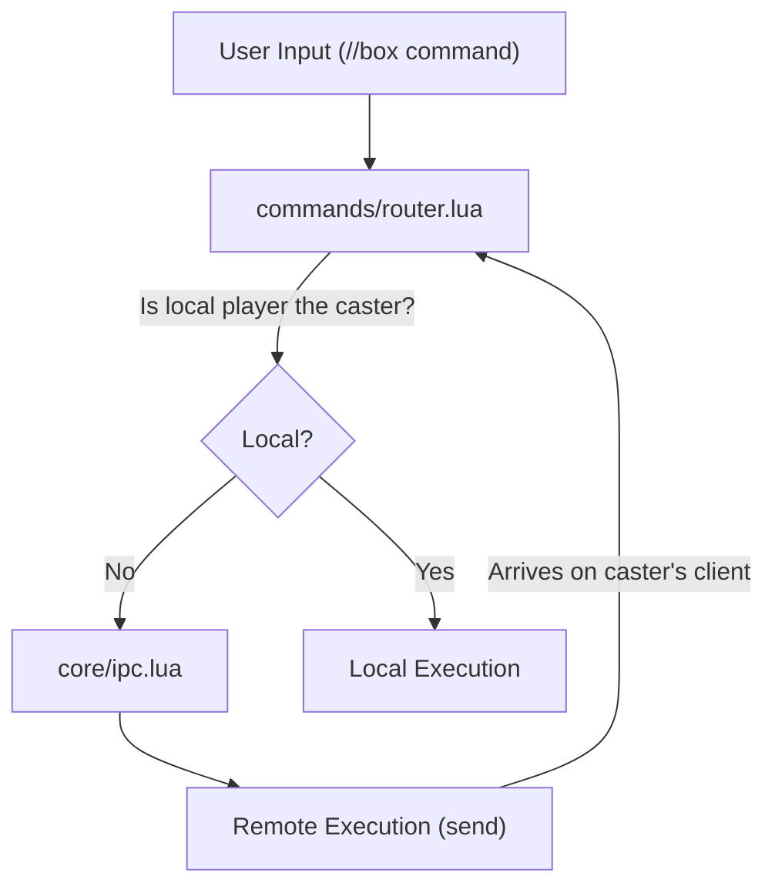
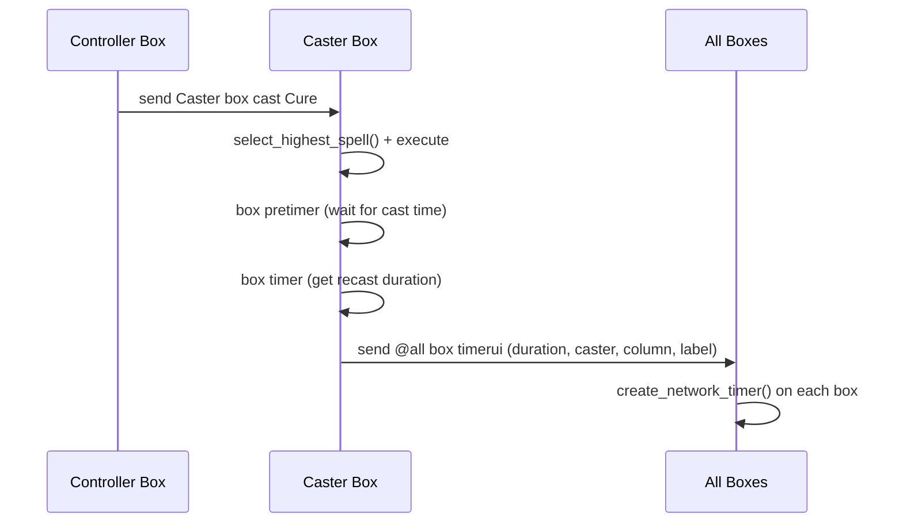

# Services & Orchestration

## Service Layer Overview

BoxCommands does not have traditional web services. Instead, the "service layer" is the orchestration of:
1. **Command routing** — dispatching user input to the correct handler
2. **IPC relay** — transparently routing commands between game clients
3. **Event-driven updates** — responding to game events (job change, party change, frame ticks)
4. **Settings synchronization** — shared state via the settings file

## Command Orchestration Flow

## IPC Protocol

All inter-box communication uses Windower's `send` command. Commands arrive as `//box <command>` on the receiving client.

### Command Categories

| Category | Commands | Direction |
|----------|----------|-----------|
| Casting | cast, ja, pet, bstpet, pact, storm, helix | Controller → Caster |
| Targeting | target | Controller → All |
| Caster Selection | setcaster | Controller → All |
| Timer Creation | pretimer, timer, timerui | Caster → All |
| Setup | setup | Local only |

### Timer Flow (Cross-Box)

## Settings Synchronization Service

The settings file acts as a shared data store since all boxes run from the same addon directory.

### Write Operations (Local Only)
- Job change → `settings_manager.update_job(my_name, new_job)`
- HP update → `settings_manager.update_max_hp(my_name, job, hp)` (after gear-load delay)
- Midcast snapshot → `state.update_cached_stats(job, category, stats)`
- Setup command → force refresh of job + HP

### Read Operations (Any Box)
- Get another character's job → `settings_manager.get_character_data(name).job`
- Get another character's max HP → `settings_manager.get_max_hp(name, job)`
- Get character display order → `settings_manager.get_characters()`

### Timing Consideration
After a job change, there is a short delay (~2-3 seconds) before HP is written to settings, allowing GearSwap to equip the job's gear and the stats to stabilize.

## Event-Driven Architecture

| Event | Source | Handler | Actions |
|-------|--------|---------|---------|
| `addon command` | User chat input | router.handle_command() | Route to appropriate handler |
| `prerender` | Windower (every frame) | event_hooks.on_prerender() | Tick timers, animate arrows, check menu state |
| `job_change` | Game event | event_hooks.on_job_change() | Update settings with new job, schedule HP refresh |
| Party change | Game event | ui_manager.rebuild() | Rebuild visible headers based on who's in party |
| Menu open/close | Windower event or packet | ui_manager.set_menu_hidden() | Hide/show UI elements |

## Menu Detection Service

Priority-ordered detection strategy:
1. **Windower events** (preferred) — use if available for menu state changes
2. **Packet reading** (fallback) — read incoming packets indicating menu open/close
3. **Safety timer** — if UI has been hidden for >60 seconds, verify menu is still open; restore if not

The safety timer only runs while UI is hidden. No periodic checks when UI is visible.
