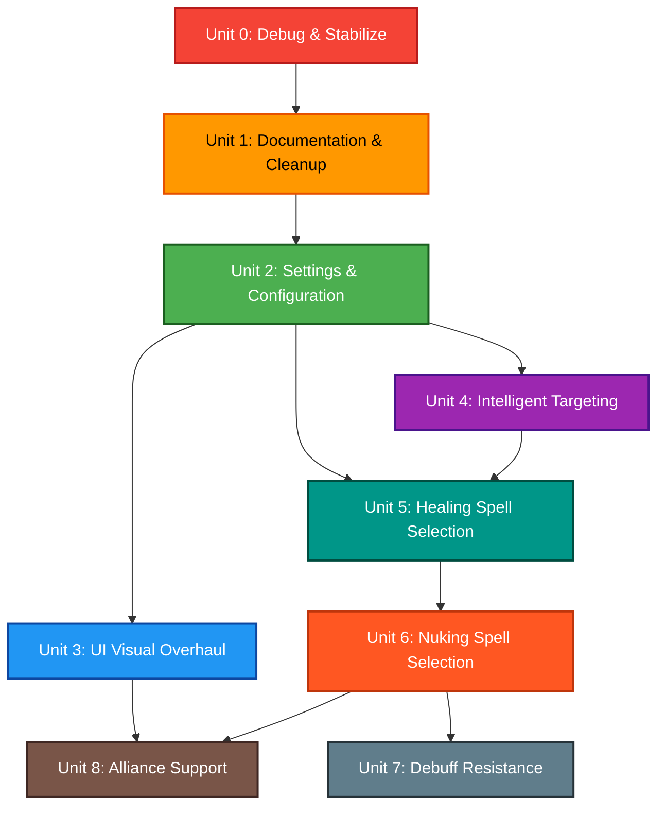

# Unit of Work — Dependency Matrix

## Dependency Graph



## Dependency Matrix

| Unit | Depends On | Reason |
|------|-----------|--------|
| Unit 0 | None | First step — establishes baseline |
| Unit 1 | Unit 0 | Cleanup builds on verified working code |
| Unit 2 | Unit 1 | Settings system replaces hardcoded data cleaned in Unit 1 |
| Unit 3 | Unit 2 | UI reads character list and config from settings |
| Unit 4 | Unit 2 | Targeting uses state module and settings |
| Unit 5 | Unit 2, Unit 4 | Healing algorithm needs settings (HP data) + targeting (resolve target before selecting spell) |
| Unit 6 | Unit 5 | Nuking reuses spell_selection utilities and stat cache from healing |
| Unit 7 | Unit 6 | Extends resistance logic built in Unit 6 |
| Unit 8 | Unit 3, Unit 6 | Alliance needs UI system + full command system working for >6 chars |

## Critical Path

```text
Unit 0 → Unit 1 → Unit 2 → Unit 3 → Unit 8
                         ↘ Unit 4 → Unit 5 → Unit 6 → Unit 7
                                                    ↘ Unit 8
```

**Longest path**: U0 → U1 → U2 → U4 → U5 → U6 → U7 (7 sequential units)

**Parallelization opportunity**: After Unit 2, Units 3 and 4 are independent and could theoretically be done in either order. However, since this is a single developer, they proceed sequentially per user preference (UI first, then features).

## Execution Order (Final)

1. Unit 0: Debug & Stabilize Baseline
2. Unit 1: Documentation & Cleanup
3. Unit 2: Settings & Configuration Foundation
4. Unit 3: UI Visual Overhaul
5. Unit 4: Intelligent Targeting
6. Unit 5: Healing Spell Selection Algorithm
7. Unit 6: Nuking Spell Selection Algorithm
8. Unit 7: Debuff Resistance (Conditional)
9. Unit 8: Alliance Support
