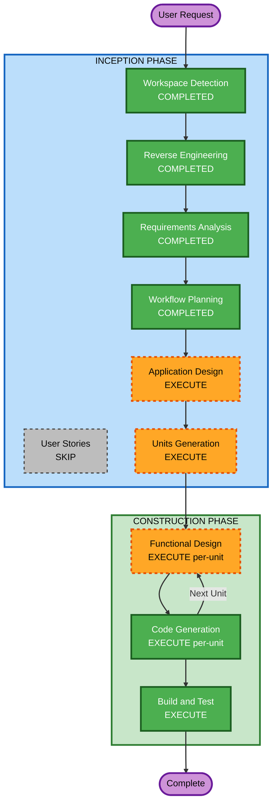

# Execution Plan

## Detailed Analysis Summary

### Transformation Scope
- **Transformation Type**: Architectural (single addon evolving into multi-module system with IPC protocol, settings management, and algorithmic subsystems)
- **Primary Changes**: UI overhaul, settings externalization, IPC protocol expansion, spell selection algorithms, target resolution intelligence
- **Related Components**: All 4 Lua source files will be significantly modified; new files added for settings, per-character config, and algorithm modules

### Change Impact Assessment
- **User-facing changes**: Yes — Complete UI redesign, new keybind behavior, smarter spell/target selection
- **Structural changes**: Yes — Elimination of hardcoded character data, new settings module, new algorithm modules, IPC protocol expansion
- **Data model changes**: Yes — New settings files (XML + per-character Lua), cached stat tables, job state tracking across boxes
- **API changes**: Yes — New IPC commands (jobupdate, jobrequest), internalized keybind commands, new box commands
- **NFR impact**: Minimal — Performance must remain acceptable in prerender loop; no infrastructure or deployment changes

### Risk Assessment
- **Risk Level**: Medium
- **Rollback Complexity**: Easy (git revert, addon is interpreted Lua)
- **Testing Complexity**: Moderate (requires multi-box game environment for full testing)

## Workflow Visualization



### Text Alternative
```text
INCEPTION PHASE:
- Workspace Detection (COMPLETED)
- Reverse Engineering (COMPLETED)
- Requirements Analysis (COMPLETED)
- User Stories (SKIP)
- Workflow Planning (COMPLETED)
- Application Design (EXECUTE)
- Units Generation (EXECUTE)

CONSTRUCTION PHASE (per-unit loop):
- Functional Design (EXECUTE, per-unit)
- Code Generation (EXECUTE, per-unit)
- Build and Test (EXECUTE, after all units)
```

## Phases to Execute

### INCEPTION PHASE
- [x] Workspace Detection (COMPLETED)
- [x] Reverse Engineering (COMPLETED)
- [x] Requirements Analysis (COMPLETED)
- [x] User Stories - SKIP
  - **Rationale**: Single user (addon author). No multiple personas or stakeholder acceptance criteria needed. Requirements are clear and self-directed.
- [x] Workflow Planning (IN PROGRESS)
- [ ] Application Design - EXECUTE
  - **Rationale**: New modules needed (settings, algorithms, IPC protocol expansion). Component relationships and service boundaries need definition before implementation.
- [ ] Units Generation - EXECUTE
  - **Rationale**: 8+ functional requirements with dependencies between them. Needs decomposition into ordered units of work for incremental delivery per the versioning scheme.

### CONSTRUCTION PHASE (per-unit)
- [ ] Functional Design - EXECUTE (per-unit)
  - **Rationale**: Complex business logic in healing/nuking algorithms (FR-7, FR-8). Target resolution rules (FR-6). Timer UI state machine. These need detailed design before code generation.
- [ ] NFR Requirements - SKIP
  - **Rationale**: No new performance, security (per user choice), or scalability requirements beyond keeping prerender loop fast. Existing architecture sufficient.
- [ ] NFR Design - SKIP
  - **Rationale**: NFR Requirements skipped.
- [ ] Infrastructure Design - SKIP
  - **Rationale**: No infrastructure — this is a client-side addon with no deployment pipeline.
- [ ] Code Generation - EXECUTE (per-unit, always)
  - **Rationale**: All units require implementation.
- [ ] Build and Test - EXECUTE (always)
  - **Rationale**: Manual in-game testing instructions needed for each unit. Test-and-commit checkpoints per versioning scheme.

### OPERATIONS PHASE
- [ ] Operations - PLACEHOLDER (no deployment infrastructure)

## Proposed Unit Structure (Preview)

Based on the implementation priority order (documentation first, then UI, then features), anticipated units:

1. **Unit: Cleanup & Documentation** (FR-2, FR-3) — Remove dead code, add comments, update README
2. **Unit: Settings & Configuration** (FR-4g, FR-4h, FR-5, FR-5b) — Settings file (shared XML, programmatically updated), dynamic party display, internalized keybinds, job/HP auto-tracking via settings
3. **Unit: UI Visual Overhaul** (FR-4a, FR-4b, FR-4c, FR-4d, FR-4e, FR-4f) — Header redesign, text styling, animated arrows, timer labels, menu hiding
4. **Unit: Intelligent Targeting** (FR-6) — Target resolution based on valid targets, undead detection
5. **Unit: Healing Spell Selection** (FR-7) — HP estimation, stat caching, optimal cure tier algorithm
6. **Unit: Nuking Spell Selection** (FR-8) — Damage/MP ratio algorithm, skill-based tier selection
7. **Unit: Debuff Resistance** (FR-9) — Conditional on FR-8c feasibility
8. **Unit: Alliance Support** (FR-10) — Multi-party UI expansion

*Final unit decomposition will be determined during Units Generation stage.*

## Estimated Timeline
- **Total Stages Remaining**: 2 Inception (Application Design, Units Generation) + per-unit Construction
- **Estimated Units**: 6-8 units of work
- **Each Unit**: Functional Design + Code Generation + Test checkpoint

## Success Criteria
- **Primary Goal**: BoxCommands becomes a fully configurable, documented, intelligently-acting multi-boxing addon
- **Key Deliverables**:
  - Clean, documented codebase with no hardcoded character data
  - Redesigned timer UI with XivParty-style text and animated indicators
  - Intelligent spell tier selection for healing and nuking
  - Smart target resolution
  - Alliance support (up to 18 characters)
- **Quality Gates**:
  - Each unit tested in-game before commit
  - Version incremented per scheme at each checkpoint
  - README stays current with all commands
- **Testing Strategy**:
  - No formal unit tests (interpreted Lua addon, no test framework)
  - In-game verification after every independently testable change
  - Sub-features that depend on each other are grouped and tested together once complete
  - At minimum: verify after each full feature (unit of work) before committing
  - Micro version bump on each test-and-commit checkpoint
