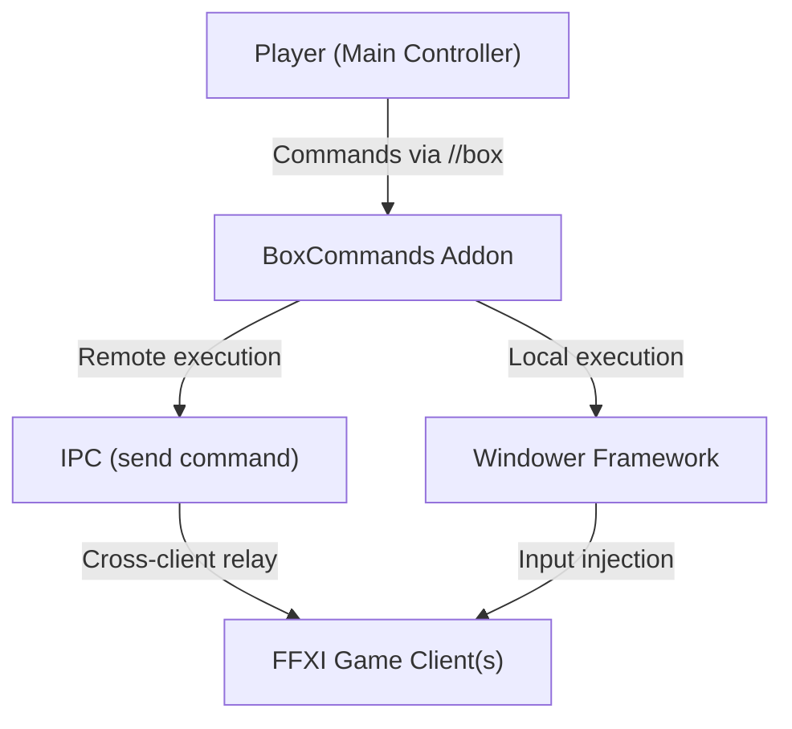

# Business Overview

## Business Context Diagram

## Business Description

- **Business Description**: BoxCommands is a Windower addon for Final Fantasy XI (FFXI) that enables a single player to control multiple game client instances (multi-boxing) from one interface. It provides a unified command system to cast spells, use job abilities, manage summoner blood pacts, and track ability recast timers across all characters in a party or alliance.
- **Business Transactions**:
  - **Spell Casting**: Cast the highest available tier of a spell on a designated target, either locally or relayed to a remote character via IPC.
  - **Job Ability Usage**: Execute job abilities (JA, Pet commands, BST pet commands) locally or on remote characters.
  - **Blood Pact Management**: Dynamically select and execute summoner blood pacts based on the active avatar and pact category.
  - **Storm/Helix Selection**: Automatically determine the optimal elemental storm or helix spell based on current day/weather conditions.
  - **Recast Timer Tracking**: After casting, track and visually display ability recast cooldowns across all characters in a columnar UI overlay.
  - **Target Management**: Set the current target for all characters simultaneously.
  - **Caster Designation**: Designate which character is the active caster receiving commands.
  - **Macro Setup**: Configure keybinds and macro pages for quick character switching.
  - **Client Launching**: Batch scripts to sequentially launch multiple FFXI game clients with proper profile file management.
- **Business Dictionary**:
  - **Multi-boxing**: Running multiple game client instances simultaneously controlled by one player.
  - **Windower**: A third-party addon framework for FFXI that provides addon loading, IPC, and API access.
  - **IPC (Inter-Process Communication)**: The `send` command mechanism that relays commands between Windower instances.
  - **Blood Pact**: Summoner job abilities that command an avatar to perform actions.
  - **Recast**: The cooldown period before an ability can be used again.
  - **Caster**: The designated character that will receive and execute a command.
  - **Target**: The entity (player, enemy, or placeholder like `<t>`) that abilities are directed at.
  - **Avatar**: A summoned creature controlled by the Summoner job class.
  - **Scholar Addendum**: A buff that unlocks access to additional spells for the Scholar job.

## Component Level Business Descriptions

### boxcommands.lua (Addon Entry Point)
- **Purpose**: Registers the addon with Windower and routes all incoming `//box` commands to the appropriate handler functions.
- **Responsibilities**: Command parsing, argument reconstruction for multi-word ability names, IPC relay decision (local vs. remote execution).

### commands.lua (Core Logic)
- **Purpose**: Implements the primary business logic for spell casting, ability usage, pact management, timer creation, and the graphical timer UI system.
- **Responsibilities**: Spell casting with highest-tier selection, job ability execution, summoner pact resolution, storm/helix elemental logic, recast timer calculation, network timer UI rendering, column header initialization.

### helper_functions.lua (Utilities)
- **Purpose**: Provides supporting utility functions for spell validation, player state management, item lookups, and the spell selection algorithm.
- **Responsibilities**: Spell availability checking (job level, addendum, blue magic, ninjutsu tools), player/inventory state initialization, highest-spell-tier selection algorithm, ninjutsu tool management, timer UI positioning, alliance party data refresh.

### data_tables.lua (Configuration Data)
- **Purpose**: Stores all static game data, UI layout constants, and lookup tables used throughout the addon.
- **Responsibilities**: UI positioning constants, character-to-column mapping, elemental relationships, macro set assignments, summoner pact definitions with durations and icons, ninjutsu tool requirements, command prefix normalization.

### Start_FFXI_Team.bat (6-Box Launcher)
- **Purpose**: Automates the sequential launch of up to 6 FFXI game clients using PlayOnline profile swapping.
- **Responsibilities**: Admin elevation, profile file management, sequential client launching with user-paced checkpoints.

### Start_FFXI_Alliance.bat (18-Box Launcher)
- **Purpose**: Automates the sequential launch of up to 18 FFXI game clients (full alliance) with party-scope selection.
- **Responsibilities**: Admin elevation, party/alliance scope selection, custom queue building, profile file management across 6 profile groups, sequential client launching.
