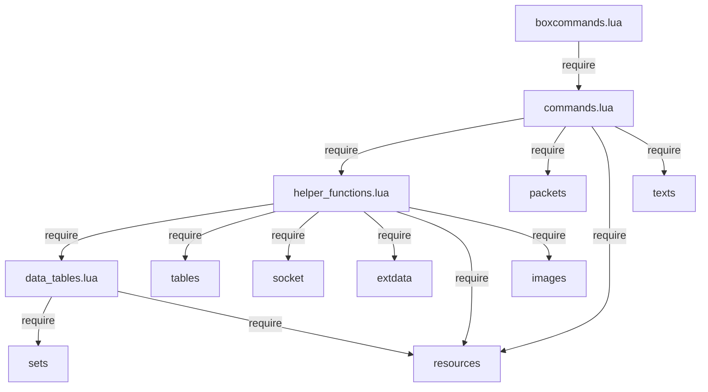

# Code Structure

## Build System
- **Type**: None (interpreted Lua addon, loaded by Windower at runtime)
- **Configuration**: No build tooling; addon is loaded directly from the filesystem by Windower's addon loader
- **Entry Point**: `boxcommands.lua` registers `_addon` metadata and hooks into `addon command` event

## Module Dependency Graph

## Key Modules

### boxcommands.lua (Entry Point)
- Registers addon metadata (`_addon.name`, `_addon.command`)
- Single event handler: `windower.register_event('addon command', ...)`
- Routes commands: `setup`, `spelllevel`, `macro`, `setcaster`, `target`, `cast`, `ja`, `pet`, `bstpet`, `pact`, `storm`, `helix`, `pretimer`, `timer`, `timerui`
- Calls `setupCommands()` and `initialize_column_headers()` on load

### commands.lua (Business Logic)
- **initialize_column_headers()**: Creates per-character text labels and role icons for the timer UI
- **setupCommands()**: Binds Ctrl+F1-F6 and Alt+F1-F6 keybinds, calls `preload_textures()`
- **cast_spell(ability_name)**: Uses `select_highest_spell()` to find best tier, executes locally or relays via IPC, triggers pretimer
- **job_ability(job, input)**: Executes a job ability with IPC relay and pretimer
- **pet_command(input)** / **bstpet_command(input)**: Pet/BST ability execution
- **handle_dynamic_pact(category)**: Resolves avatar-specific pact from category, determines target type, executes, triggers pact timer
- **handle_storm()** / **handle_helix()**: Elemental weather/day logic for Scholar spells
- **get_duration(abilityType, abilityName, caster)**: Retrieves recast duration from game APIs
- **create_network_timer(...)**: Creates a visual timer bar at computed grid position
- **preload_textures()**: Loads master bar images once for reuse
- **prerender event**: Ticks down active timers, updates foreground bar widths, repositions on expiry

### helper_functions.lua (Utilities)
- **select_highest_spell(ability)**: Core spell selection algorithm - finds all tiers of a spell, filters by availability, selects highest castable
- **check_spell(available_spells, spell)**: Validates spell access (job level, addendum, blue magic set, ninjutsu tools)
- **filter_pretarget(action)**: Pre-execution validation for spells, weapon skills, job abilities, monster skills
- **initialize_globals(player)**: Sets up player state, equipment, inventory structures
- **refresh_player()**: Refreshes player data and active buffs
- **refresh_group_info(party, partyinfo)**: Rebuilds alliance structure from Windower party data
- **find_items(ids)**: Searches all enabled bags for items by ID
- **getNinjaTool(ability)**: Manages ninjutsu tool inventory (retrieves from storage, opens toolbags)
- **get_character_column(char_name)**: Maps character name to UI column index
- **reposition_column_elements(col_index)**: Recalculates Y positions for all timers in a column after expiry
- **create_timer_ui(x, y)**: Creates background/foreground image pair for a timer bar
- **set_macro_page(set, book)**: Utility to change macro book/set via game commands

### data_tables.lua (Configuration)
- **UI_Layout**: Positioning constants (base_x, base_y, column_width, row_height, bar_width)
- **UI_Style**: Visual constants (bar_width=120, bar_height=14)
- **char_columns**: Hardcoded character name to column index mapping
- **elements**: Full elemental relationship tables (weak_to, strong_to, storm_of, helix_of, of_helix)
- **macro_sets**: Macro book assignments per party slot
- **validabils**: Multi-language ability lookup tables (populated at load time by helper_functions.lua)
- **unify_prefix**: Command prefix normalization (/magic->/ma, /song->/ma, etc.)
- **tool_map** / **universal_tool_map**: Ninjutsu spell to required tool item mappings
- **pacts**: Complete summoner blood pact table by category and avatar
- **pact_wards**: Duration and icon data for ward-type pacts
- **avatar_icons**: Icon paths per avatar
- **addendum_white** / **addendum_black**: Scholar addendum spell lists

## Existing Files Inventory

- `boxcommands.lua` - Addon registration, command routing, entry point
- `commands.lua` - Core business logic (casting, abilities, timers, UI)
- `helper_functions.lua` - Utility functions (spell selection, validation, state management)
- `data_tables.lua` - Static configuration data and lookup tables
- `Start_FFXI_Team.bat` - 6-character team launcher script
- `Start_FFXI_Alliance.bat` - 18-character alliance launcher script
- `Graphics/bar_bg.png` - Timer bar background image
- `Graphics/bar_fg.png` - Timer bar foreground (fill) image
- `README.md` - Minimal documentation (single line)
- `.gitignore` - Git ignore rules

## Design Patterns

### Command Router Pattern
- **Location**: `boxcommands.lua`
- **Purpose**: Central dispatch of all addon commands to handler functions
- **Implementation**: Single event handler with if/elseif chain parsing command strings

### IPC Relay Pattern
- **Location**: `cast_spell()`, `job_ability()`, `pet_command()`, `bstpet_command()`, `handle_dynamic_pact()`
- **Purpose**: Transparently route commands to the correct game client
- **Implementation**: Checks if current player is the designated caster; if not, wraps command with `send {caster} //box ...`

### Highest-Tier Selection Pattern
- **Location**: `select_highest_spell()` in `helper_functions.lua`
- **Purpose**: Automatically cast the most powerful available version of a spell
- **Implementation**: Iterates through all tiers (I-VIII or Ichi/Ni/San), filters by availability and MP, selects highest ID that passes validation

### Timer Grid Layout Pattern
- **Location**: `create_network_timer()`, `reposition_column_elements()`, `prerender` event
- **Purpose**: Display recast timers in a character-based column grid with dynamic stacking
- **Implementation**: Each timer placed at (column * width, row * height); rows dynamically recomputed when timers expire

### Texture Pooling Pattern
- **Location**: `preload_textures()`, `create_timer_ui()`
- **Purpose**: Avoid repeated image loading by reusing master texture references
- **Implementation**: Two master image objects loaded once; timer UIs reference them (note: this currently has a shared-state issue)

## Critical Dependencies

### Windower Framework
- **Version**: Not pinned (addon runs on whatever Windower version is installed)
- **Usage**: Core runtime - provides addon loading, event system, game API access, IPC, UI primitives
- **Purpose**: Required framework for all FFXI addon functionality

### Windower Resources Library
- **Version**: Bundled with Windower
- **Usage**: Accessed via `require('resources')` throughout all modules
- **Purpose**: Provides game data lookups (spells, abilities, items, buffs, weather, days, elements)

### Windower Images/Texts Libraries
- **Version**: Bundled with Windower
- **Usage**: Timer bar rendering (images) and column headers (texts)
- **Purpose**: UI primitive creation and manipulation

### Windower Packets Library
- **Version**: Bundled with Windower
- **Usage**: Required in commands.lua (currently unused directly but available)
- **Purpose**: Low-level packet construction (potential future use)
