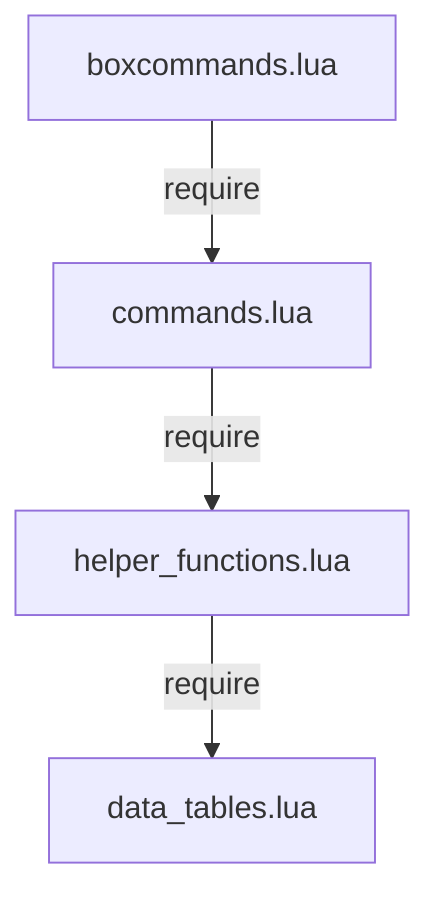

# Dependencies

## Internal Dependencies

### boxcommands.lua depends on commands.lua
- **Type**: Runtime (require)
- **Reason**: All command handler functions (setupCommands, cast_spell, job_ability, etc.) are defined in commands.lua

### commands.lua depends on helper_functions.lua
- **Type**: Runtime (require)
- **Reason**: Uses spell selection (select_highest_spell), state initialization (initialize_globals), and utility functions

### helper_functions.lua depends on data_tables.lua
- **Type**: Runtime (require)
- **Reason**: Uses lookup tables (validabils, unify_prefix, tool_map, char_columns, elements, addendum tables) for spell validation and tool management

## External Dependencies

### Windower Framework (Runtime Host)
- **Version**: 4.x (not pinned, addon runs on installed version)
- **Purpose**: Required runtime environment - provides addon loading, event system, all game APIs
- **License**: Freeware (third-party tool for FFXI)

### resources (Windower Library)
- **Version**: Bundled with Windower
- **Purpose**: Game data access - spells, job_abilities, weapon_skills, monster_skills, items, buffs, bags, weather, days, elements, races, jobs
- **Used by**: commands.lua, helper_functions.lua, data_tables.lua

### packets (Windower Library)
- **Version**: Bundled with Windower
- **Purpose**: Network packet manipulation (required but not actively used in current code)
- **Used by**: commands.lua

### texts (Windower Library)
- **Version**: Bundled with Windower
- **Purpose**: Text UI primitives for column header labels
- **Used by**: commands.lua

### images (Windower Library)
- **Version**: Bundled with Windower
- **Purpose**: Image UI primitives for timer bars and role icons
- **Used by**: helper_functions.lua, commands.lua

### tables (Windower Library)
- **Version**: Bundled with Windower
- **Purpose**: Extended table utilities (reassign, contains, etc.)
- **Used by**: helper_functions.lua

### sets (Windower Library)
- **Version**: Bundled with Windower
- **Purpose**: Set data structure (S{} constructor)
- **Used by**: data_tables.lua

### socket (LuaSocket)
- **Version**: Bundled with Windower/Lua
- **Purpose**: Required by helper_functions.lua (timing-related, minimal usage)
- **Used by**: helper_functions.lua

### extdata (Windower Library)
- **Version**: Bundled with Windower
- **Purpose**: Extended item data parsing
- **Used by**: helper_functions.lua

### autoPOL.exe (External Tool)
- **Version**: Unknown (user-supplied)
- **Purpose**: Automated PlayOnline login for batch launcher scripts
- **Used by**: Start_FFXI_Team.bat, Start_FFXI_Alliance.bat
